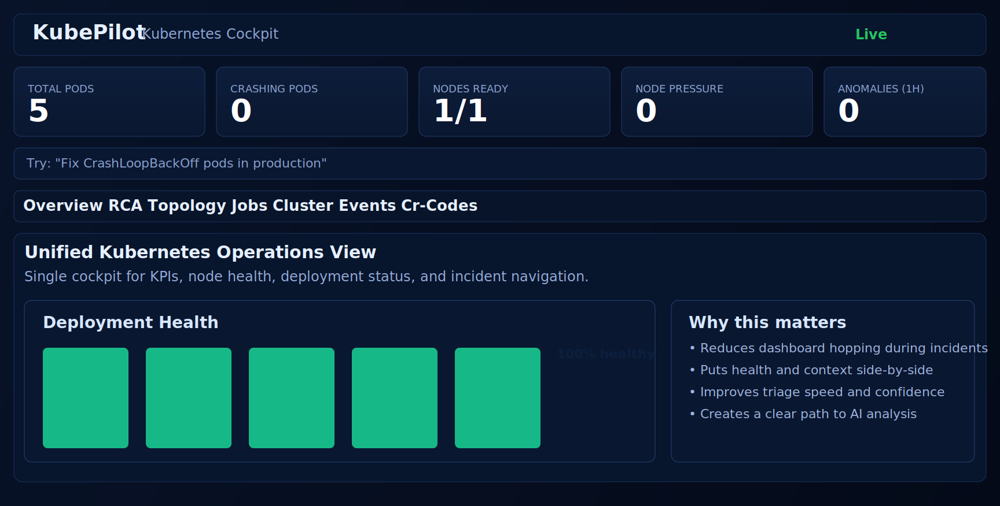
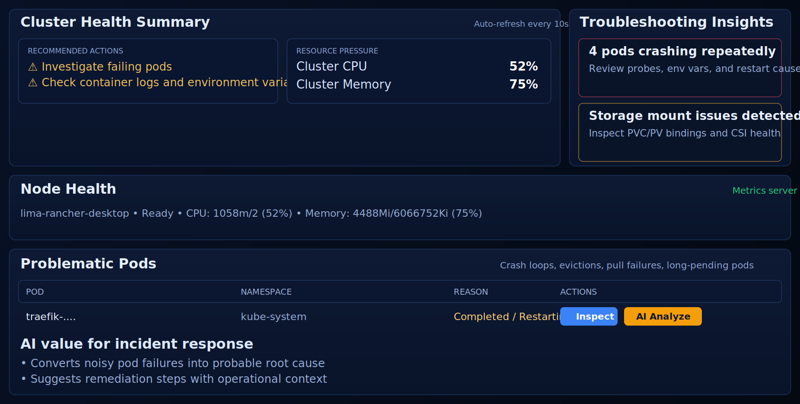

# KubePilot

KubePilot is an AI-assisted Kubernetes operations platform with:

1. A live web dashboard for cluster health, topology, and troubleshooting.
2. AI diagnostics to explain failures and suggest remediation actions.
3. A Go CLI/server for automation and integrations.
4. An MCP server for agent-driven workflows.

It is built for faster incident response, safer operations, and clearer visibility when clusters get noisy.

## Why KubePilot

KubePilot helps you move from "what is broken?" to "what should I do next?" quickly.

1. Cluster Events & Troubleshooting view surfaces warning events, pressure signals, and failing pods in one place.
2. AI Analyze on problematic pods provides root-cause and action-oriented guidance.
3. Topology canvas visualizes Ingress -> Service -> Workload -> Pod relationships.
4. Kubeconfig switcher lets you move across clusters from the UI.

## Screenshots

The repo is prepared to show screenshots directly on GitHub.




You can replace these SVG assets with PNG/JPG captures at any time.

## Quick Start

### Prerequisites

1. Go 1.22+
2. Node.js 18+ and npm
3. A reachable Kubernetes cluster and kubeconfig
4. Optional but recommended: Ollama for local AI model inference

### 1) Clone and install dashboard dependencies

```bash
git clone https://github.com/kubepilot/kubepilot.git
cd kubepilot
make dashboard-install
```

### 2) Build dashboard + binary

```bash
make dashboard
make build
```

### 3) Run KubePilot

```bash
KUBEPILOT_KUBECONFIG="$HOME/.kube/config" ./dist/kubepilot serve --dashboard-port=8383
```

Open:

1. Dashboard/API: http://localhost:8383
2. MCP server: :9090

## Installation Options

### Option A: Build from source (recommended for contributors)

```bash
make dashboard-install
make dashboard
make build
```

Binary output: `dist/kubepilot`

### Option B: Docker image

```bash
make docker-build
docker run --rm -p 8383:8383 -p 9090:9090 \
	-e KUBEPILOT_KUBECONFIG=/root/.kube/config \
	-v "$HOME/.kube:/root/.kube:ro" \
	ghcr.io/kubepilot/kubepilot:latest \
	serve --dashboard-port=8383
```

### Option C: Kubernetes deployment and Helm chart

Helm chart files live in `charts/kubepilot/`.

```bash
helm upgrade --install kubepilot charts/kubepilot -n kubepilot --create-namespace
```

## Configuration

Copy `config.example.yaml` to `config.yaml` (or `$HOME/.kubepilot/config.yaml`) and adjust values.

Important environment variables:

1. `KUBEPILOT_KUBECONFIG`
2. `KUBEPILOT_DASHBOARD_PORT`
3. `KUBEPILOT_MCP_PORT`
4. `KUBEPILOT_OLLAMA_BASE_URL`
5. `KUBEPILOT_OLLAMA_MODEL`
6. `KUBEPILOT_LOG_LEVEL`

Example:

```bash
export KUBEPILOT_KUBECONFIG="$HOME/.kube/config"
export KUBEPILOT_OLLAMA_BASE_URL="http://localhost:11434/v1"
export KUBEPILOT_OLLAMA_MODEL="llama3"
./dist/kubepilot serve --dashboard-port=8383
```

## Dashboard Guide

### Overview tab

Shows high-level cluster KPIs:

1. Total pods
2. Crashing pods
3. Nodes ready
4. Node pressure
5. Recent anomalies

### Topology tab

Visual service graph in canvas form:

1. Ingress
2. Service
3. Deployment / StatefulSet / DaemonSet
4. Pod

Supports all namespaces and per-namespace inspection.

### Cluster Events tab

Purpose-built for incident response:

1. Health summary cards
2. Troubleshooting insight cards
3. Node health with pressure/usage
4. Problematic pod table
5. Event stream with filters and search

### Pod-level troubleshooting

For each problematic pod:

1. Inspect: status, events, logs, and container details.
2. AI Analyze: root-cause summary + suggested actions.

This makes KubePilot especially useful during CrashLoopBackOff, scheduling failures, mount errors, and pull failures.

## CLI Usage

```bash
# Start server with default ports
./dist/kubepilot serve

# Change dashboard/API port
./dist/kubepilot serve --dashboard-port=8390

# Query RCA list
./dist/kubepilot rca list --server http://localhost:8383
```

## Development

### Common make targets

```bash
make dashboard-install
make dashboard
make build
make test
make lint
make clean
```

### Local dashboard development mode

```bash
make dashboard-dev
```

### CRD generation

```bash
make generate
```

## Example manifests

Examples are in `manifests/examples/`.

1. `production-job.yaml`
2. `go-crashloop-test.yaml`

Use these to create test scenarios for troubleshooting and AI analysis demos.

## Landing Page

A standalone hostable landing page is available at:

`docs/landing/index.html`

You can host this via GitHub Pages, Netlify, or any static web host.

## Benefits During Real Incidents

1. Faster triage: events, pod issues, and node pressure are correlated in one workflow.
2. Better handoffs: AI summaries reduce context loss between engineers.
3. Safer remediation: actionable suggestions before blind restarts or scale changes.
4. Better visibility: topology view clarifies blast radius and service dependencies.

## Contributing

1. Fork and branch from `master`.
2. Keep PRs focused and include screenshots for UI changes.
3. Run tests/lint before opening PR.

## License

See repository license information in the root or project settings.
