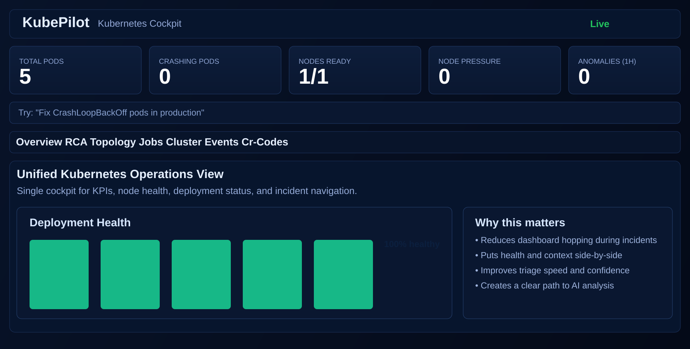
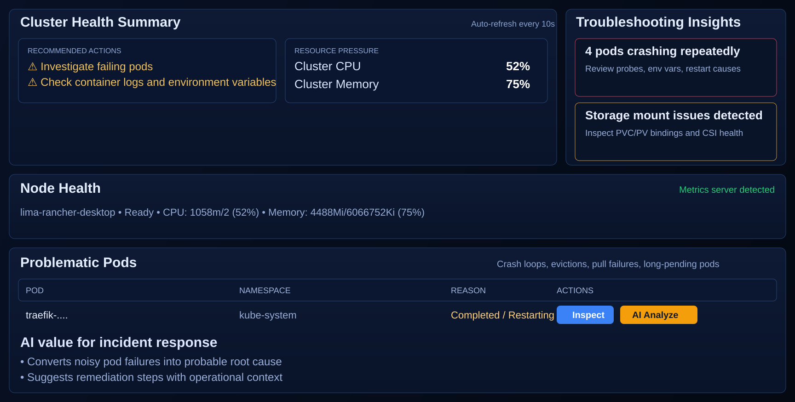
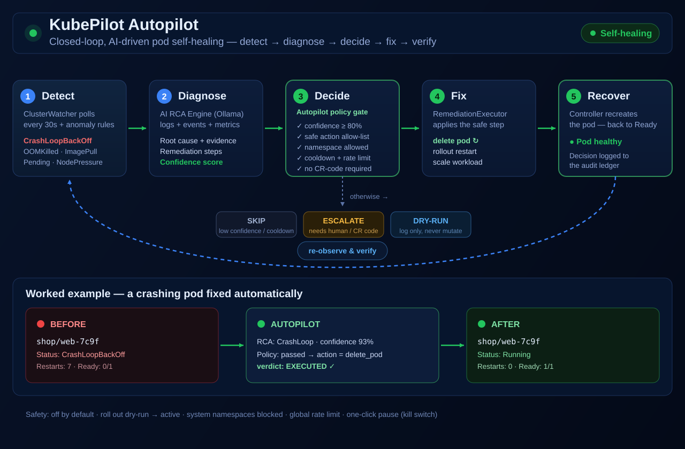

# KubePilot

KubePilot is an AI-assisted Kubernetes operations platform with:

1. A live web dashboard for cluster health, topology, and troubleshooting.
2. AI diagnostics to explain failures and suggest remediation actions.
3. A Go CLI/server for automation and integrations.
4. An MCP server for agent-driven workflows.

It is built for faster incident response, safer operations, and clearer visibility when clusters get noisy.

## Why KubePilot

KubePilot helps you move from "what is broken?" to "what should I do next?" quickly.

1. Cluster Events & Troubleshooting view surfaces warning events, pressure signals, and failing pods in one place.
2. AI Analyze on problematic pods provides root-cause and action-oriented guidance.
3. Topology canvas visualizes Ingress -> Service -> Workload -> Pod relationships.
4. Kubeconfig switcher lets you move across clusters from the UI.

## Screenshots

The repo is prepared to show screenshots directly on GitHub.





You can replace these SVG assets with PNG/JPG captures at any time.

## Quick Start

### Prerequisites

1. Go 1.22+
2. Node.js 18+ and npm
3. A reachable Kubernetes cluster and kubeconfig
4. Optional but recommended: Ollama for local AI model inference

### 1) Clone and install dashboard dependencies

```bash
git clone https://github.com/bwalia/kubepilot.git
cd kubepilot
make dashboard-install
```

### 2) Build dashboard + binary

```bash
make dashboard
make build
```

### 3) Run KubePilot

```bash
KUBEPILOT_KUBECONFIG="$HOME/.kube/config" ./dist/kubepilot serve --dashboard-port=8383
```

Open:

1. Dashboard/API: http://localhost:8383
2. MCP server: :9090

## Installation Options

### Option A: Build from source (recommended for contributors)

```bash
make dashboard-install
make dashboard
make build
```

Binary output: `dist/kubepilot`

### Option B: Docker image

```bash
make docker-build
docker run --rm -p 8383:8383 -p 9090:9090 \
	-e KUBEPILOT_KUBECONFIG=/root/.kube/config \
	-v "$HOME/.kube:/root/.kube:ro" \
	ghcr.io/kubepilot/kubepilot:latest \
	serve --dashboard-port=8383
```

### Option C: Helm chart (recommended for Kubernetes)

Helm chart files live in `charts/kubepilot/`. Requires Helm 3.10+.

#### Add the Helm repository

```bash
helm repo add kubepilot https://bwalia.github.io/kubepilot
helm repo update
```

#### Quick install (ClusterIP + port-forward)

The fastest way to get KubePilot running as a pod analysis tool:

```bash
# Install from the published repo
helm upgrade --install kubepilot kubepilot/kubepilot \
  -n kubepilot --create-namespace

# Or install from local source
# Install into its own namespace
helm upgrade --install kubepilot charts/kubepilot \
  -n kubepilot --create-namespace

# Port-forward to access the dashboard locally
kubectl port-forward svc/kubepilot -n kubepilot 8080:8080

# Open http://localhost:8080
```

#### Install with NodePort (direct node access)

Expose the dashboard on a fixed node port — useful for bare-metal clusters, local Kind/Minikube setups, or when you don't have an ingress controller:

```bash
helm upgrade --install kubepilot charts/kubepilot \
  -n kubepilot --create-namespace \
  --set service.type=NodePort \
  --set service.nodePorts.dashboard=30080 \
  --set service.nodePorts.mcp=30090

# Access via any node IP:
# Dashboard: http://<NODE_IP>:30080
# MCP:       http://<NODE_IP>:30090
```

#### Install with Ingress (domain access)

Expose KubePilot behind a domain name. Requires an Ingress controller (nginx, traefik, etc.) already running in the cluster:

```bash
helm upgrade --install kubepilot charts/kubepilot \
  -n kubepilot --create-namespace \
  --set ingress.enabled=true \
  --set ingress.className=nginx \
  --set "ingress.hosts[0].host=kubepilot.example.com" \
  --set "ingress.hosts[0].paths[0].path=/" \
  --set "ingress.hosts[0].paths[0].pathType=Prefix"
```

With TLS (cert-manager):

```bash
helm upgrade --install kubepilot charts/kubepilot \
  -n kubepilot --create-namespace \
  --set ingress.enabled=true \
  --set ingress.className=nginx \
  --set "ingress.annotations.cert-manager\.io/cluster-issuer=letsencrypt-prod" \
  --set "ingress.hosts[0].host=kubepilot.example.com" \
  --set "ingress.hosts[0].paths[0].path=/" \
  --set "ingress.hosts[0].paths[0].pathType=Prefix" \
  --set "ingress.tls[0].secretName=kubepilot-tls" \
  --set "ingress.tls[0].hosts[0]=kubepilot.example.com"
```

#### Install with LoadBalancer

For cloud providers (AWS, GCP, Azure) that provision external load balancers:

```bash
helm upgrade --install kubepilot charts/kubepilot \
  -n kubepilot --create-namespace \
  --set service.type=LoadBalancer
```

#### Custom values file

For production deployments, use a values override file:

```bash
helm upgrade --install kubepilot charts/kubepilot \
  -n kubepilot --create-namespace \
  -f my-values.yaml
```

Example `my-values.yaml`:

```yaml
replicaCount: 1

image:
  repository: ghcr.io/kubepilot/kubepilot
  tag: "0.1.0"

service:
  type: ClusterIP

ingress:
  enabled: true
  className: nginx
  annotations:
    cert-manager.io/cluster-issuer: letsencrypt-prod
  hosts:
    - host: kubepilot.example.com
      paths:
        - path: /
          pathType: Prefix
  tls:
    - secretName: kubepilot-tls
      hosts:
        - kubepilot.example.com

kubepilot:
  ollamaBaseURL: "http://ollama.ollama.svc:11434/v1"
  ollamaModel: llama3
  logLevel: info

networkPolicy:
  enabled: true

resources:
  requests:
    cpu: 200m
    memory: 256Mi
  limits:
    cpu: 1000m
    memory: 1Gi
```

#### Uninstall

```bash
helm uninstall kubepilot -n kubepilot
kubectl delete namespace kubepilot
```

### Option D: Plain Kubernetes manifests (no Helm)

If you prefer raw manifests without Helm, generate them with `helm template`:

```bash
helm template kubepilot charts/kubepilot \
  -n kubepilot \
  --set service.type=NodePort \
  --set service.nodePorts.dashboard=30080 \
  > kubepilot-manifests.yaml

kubectl create namespace kubepilot
kubectl apply -f kubepilot-manifests.yaml -n kubepilot
```

Or apply the CRDs and generated manifests separately:

```bash
kubectl apply -f manifests/crds/
helm template kubepilot charts/kubepilot -n kubepilot | kubectl apply -n kubepilot -f -
```

### Option E: systemd (bare-metal / VM, no Kubernetes)

Run KubePilot as a long-lived host service — how the reference deployment behind
a domain is run. Templates live in `deploy/systemd/`.

```bash
# Build the binary, then install the unit + env file and start the service:
make build
sudo cp dist/kubepilot /opt/kubepilot/kubepilot      # or your install path
sudo scripts/install-kubepilot-systemd.sh
```

The installer refreshes the unit from `deploy/systemd/kubepilot.service` and, the
first time only, seeds `/etc/kubepilot/kubepilot.env` (mode `0600`) from the
example so it never clobbers existing credentials. **Dashboard auth is enabled by
default** in that env file — edit `KUBEPILOT_DASHBOARD_AUTH_PASSWORD`, then
`sudo systemctl restart kubepilot`. With auth on, the browser shows its native
sign-in dialog and loads the dashboard once the credentials match.

See [docs/NODE_AGENT.md](docs/NODE_AGENT.md) for the node agent, which puts each
machine's real hardware (vendor, model, serial, CPU, disks) on its Node object
so the dashboard can tell your boxes apart.

See [docs/DEPLOYMENT.md](docs/DEPLOYMENT.md) for the full walkthrough, including
how to verify auth is enforced.

### Helm Chart Reference

| Parameter | Description | Default |
|---|---|---|
| `replicaCount` | Number of KubePilot replicas | `1` |
| `image.repository` | Container image | `ghcr.io/kubepilot/kubepilot` |
| `image.tag` | Image tag (defaults to chart appVersion) | `""` |
| `service.type` | Service type: ClusterIP, NodePort, LoadBalancer | `ClusterIP` |
| `service.dashboardPort` | Dashboard/API port | `8080` |
| `service.mcpPort` | MCP server port | `9090` |
| `service.nodePorts.dashboard` | NodePort for dashboard (when type=NodePort) | `""` |
| `service.nodePorts.mcp` | NodePort for MCP (when type=NodePort) | `""` |
| `ingress.enabled` | Enable Ingress resource | `false` |
| `ingress.className` | Ingress class name | `nginx` |
| `ingress.hosts` | Ingress host rules | `[{host: kubepilot.local}]` |
| `ingress.tls` | Ingress TLS configuration | `[]` |
| `kubepilot.ollamaBaseURL` | Ollama API endpoint | `http://localhost:11434/v1` |
| `kubepilot.ollamaModel` | AI model name | `llama3` |
| `kubepilot.logLevel` | Log level | `info` |
| `networkPolicy.enabled` | Enable NetworkPolicy | `false` |
| `metrics.enabled` | Enable metrics endpoint | `true` |
| `metrics.serviceMonitor.enabled` | Enable Prometheus ServiceMonitor | `false` |
| `podDisruptionBudget.enabled` | Enable PDB | `false` |
| `serviceAccount.create` | Create ServiceAccount | `true` |

## Configuration

Copy `config.example.yaml` to `config.yaml` (or `$HOME/.kubepilot/config.yaml`) and adjust values.

Important environment variables:

1. `KUBEPILOT_KUBECONFIG`
2. `KUBEPILOT_DASHBOARD_PORT`
3. `KUBEPILOT_MCP_PORT`
4. `KUBEPILOT_OLLAMA_BASE_URL`
5. `KUBEPILOT_OLLAMA_MODEL`
6. `KUBEPILOT_LOG_LEVEL`

Example:

```bash
export KUBEPILOT_KUBECONFIG="$HOME/.kube/config"
export KUBEPILOT_OLLAMA_BASE_URL="http://localhost:11434/v1"
export KUBEPILOT_OLLAMA_MODEL="llama3"
./dist/kubepilot serve --dashboard-port=8383
```

### Security Hardening (Recommended for shared/network access)

Enable auth and keep mutation endpoints disabled unless explicitly needed:

```bash
KUBEPILOT_DASHBOARD_AUTH_ENABLED=true \
KUBEPILOT_DASHBOARD_AUTH_USERNAME=admin \
KUBEPILOT_DASHBOARD_AUTH_PASSWORD='change-me' \
KUBEPILOT_ENABLE_KUBECONFIG_MUTATIONS=false \
KUBEPILOT_ENABLE_ACTION_MUTATIONS=false \
KUBEPILOT_CORS_ALLOWED_ORIGINS='https://kubepilot.example.com' \
./dist/kubepilot serve --dashboard-port=8383
```

You can also use Bearer token auth via `KUBEPILOT_DASHBOARD_AUTH_TOKEN`.

### Slack Notifications

Slack alerting is **built in but OFF by default**. The integration lives in
`pkg/observability/notifier.go`; with no webhook URL configured,
`NewSlackNotifier` returns `nil` and nothing is sent (the startup log will not
contain a `Slack notifier enabled` line).

**Enable it** by setting the following (env vars, or the equivalent
`--slack-webhook-url` / `--slack-min-severity` / `--notifier-dashboard-url`
flags):

```bash
KUBEPILOT_SLACK_WEBHOOK_URL=https://hooks.slack.com/services/XXX/YYY/ZZZ
KUBEPILOT_SLACK_MIN_SEVERITY=high                        # critical|high|medium|low|info (default: high)
KUBEPILOT_NOTIFIER_DASHBOARD_URL=http://your-host:8383   # optional — adds a dashboard link to each message
```

**What it sends.** Messages fire on two events, and only for severity ≥ the
configured minimum (`high` by default, so `medium`/`low`/`info` are skipped):

1. **Anomaly detected** (before RCA runs):

   ```
   *Anomaly detected* — `crashloop-detector` in `dev/opsapi-...`
   *Severity:* HIGH
   *Detail:* Back-off restarting failed container
   ```

2. **RCA report finalized** (richer card):

   ```
   🚨 *RCA: CrashLoop* — `dev/opsapi-...` (HIGH)
   *Summary:* Container exits non-zero on startup...
   *Confidence:* 95%
   *Dashboard:* http://your-host:8383/
   ```

> **⚠️ Known gap — Autopilot executions are not sent to Slack.**
> The notifier currently exposes only `NotifyAnomaly` and `NotifyReport`, both
> wired into the cluster watcher. The Autopilot controller has **no notifier
> hook**, so Slack will tell you *"a pod is crash-looping"* and *"here is the
> root cause"*, but **not** *"Autopilot just recycled/deleted pod X"*. Posting a
> card on Autopilot `executed`/`escalated` decisions is a planned follow-up.

## Dashboard Guide

### Overview tab

Shows high-level cluster KPIs:

1. Total pods
2. Crashing pods
3. Nodes ready
4. Node pressure
5. Recent anomalies

### Topology tab

Visual service graph in canvas form:

1. Ingress
2. Service
3. Deployment / StatefulSet / DaemonSet
4. Pod

Supports all namespaces and per-namespace inspection.

### Cluster Events tab

Purpose-built for incident response:

1. Health summary cards
2. Troubleshooting insight cards
3. Node health with pressure/usage
4. Problematic pod table
5. Event stream with filters and search

### Pod-level troubleshooting

For each problematic pod:

1. Inspect: status, events, logs, and container details.
2. AI Analyze: root-cause summary + suggested actions.

This makes KubePilot especially useful during CrashLoopBackOff, scheduling failures, mount errors, and pull failures.

## CLI Usage

```bash
# Start server with default ports
./dist/kubepilot serve

# Change dashboard/API port
./dist/kubepilot serve --dashboard-port=8390

# Query RCA list
./dist/kubepilot rca list --server http://localhost:8383
```

## Development

### Common make targets

```bash
make dashboard-install
make dashboard
make build
make test
make lint
make clean
```

### Local dashboard development mode

```bash
make dashboard-dev
```

### CRD generation

```bash
make generate
```

## Example manifests

Examples are in `manifests/examples/`.

1. `production-job.yaml`
2. `go-crashloop-test.yaml`

Use these to create test scenarios for troubleshooting and AI analysis demos.

## Landing Page

A standalone hostable landing page is available at:

`docs/landing/index.html`

You can host this via GitHub Pages, Netlify, or any static web host.

## Benefits During Real Incidents

1. Faster triage: events, pod issues, and node pressure are correlated in one workflow.
2. Better handoffs: AI summaries reduce context loss between engineers.
3. Safer remediation: actionable suggestions before blind restarts or scale changes.
4. Better visibility: topology view clarifies blast radius and service dependencies.

## Contributing

1. Fork and branch from `master`.
2. Keep PRs focused and include screenshots for UI changes.
3. Run tests/lint before opening PR.

## License

See repository license information in the root or project settings.
