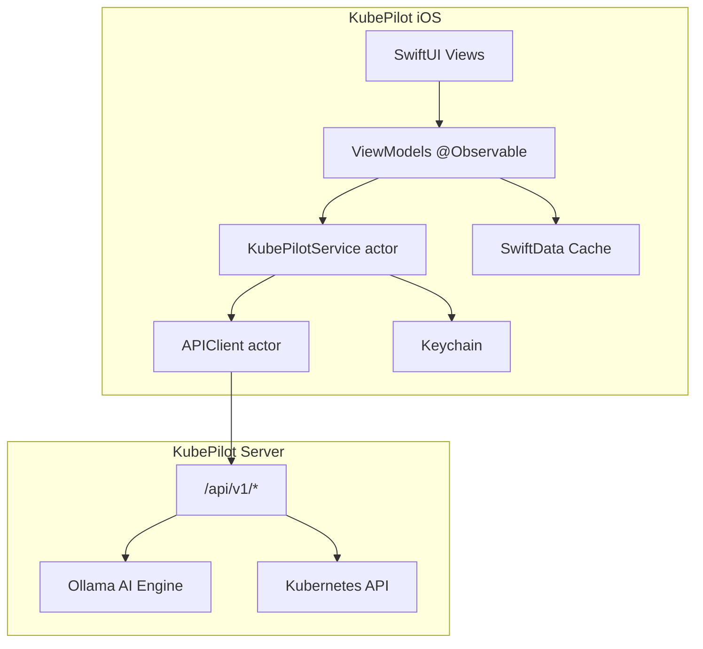

# KubePilot Native iOS App

Production-ready native iOS companion for KubePilot — an AI-first Kubernetes troubleshooting experience for engineers on the move.

## Overview

The iOS app connects to the existing KubePilot Go backend (`/api/v1/*`) and reuses its AI engine, RCA pipeline, and cluster APIs. It is **not** a mobile port of the web dashboard; it optimises for incident response, AI-assisted diagnosis, and rapid navigation to failing workloads.

| Layer | Technology |
|-------|------------|
| Language | Swift 6 |
| UI | SwiftUI |
| Architecture | MVVM + `@Observable` |
| Networking | `URLSession` actor (`APIClient`) |
| Persistence | SwiftData + Keychain |
| Widgets | WidgetKit |
| Shortcuts / Siri | App Intents |
| CI/CD | GitHub Actions + Fastlane |

## Project Structure

```
ios/
├── project.yml                 # XcodeGen spec
├── generate.sh                 # Generate KubePilot.xcodeproj
├── KubePilot/
│   ├── App/                    # Entry point, root navigation
│   ├── Core/
│   │   ├── Networking/         # APIClient, KubePilotAPI, KubePilotService
│   │   ├── Auth/               # Keychain, biometrics
│   │   ├── Models/             # API + domain models
│   │   ├── Persistence/        # SwiftData cache
│   │   └── Design/             # Theme, shared components
│   ├── Features/
│   │   ├── Dashboard/          # Health cards, insights, problem pods
│   │   ├── Pods/               # List + detail (logs, events, YAML, AI)
│   │   ├── AI/                 # Persistent AI assistant
│   │   ├── Alerts/             # Events, anomalies, RCA
│   │   ├── Nodes/              # Node list + detail
│   │   ├── Logs/               # Log viewer with live tail
│   │   ├── Onboarding/         # Server connect + Face ID
│   │   └── Settings/
│   └── Shared/AppIntents/      # Siri + Shortcuts
├── KubePilotWidgets/           # Home Screen widgets
├── KubePilotTests/             # Unit tests
└── fastlane/                   # TestFlight / App Store lanes
```

## Getting Started

### Prerequisites

- Xcode 16+ (Swift 6)
- XcodeGen (`brew install xcodegen`)
- Running KubePilot server (`./dist/kubepilot serve --dashboard-port=8383`)

### Generate & Open

```bash
cd ios
./generate.sh
open KubePilot.xcodeproj
```

### Connect to Server

1. Launch the app in Simulator or device
2. Enter server URL (e.g. `http://localhost:8383` — use your Mac's LAN IP on device)
3. Choose auth method (Bearer token or Basic auth)
4. Enable Face ID if desired

> **Note:** OAuth providers (GitHub, Google, Microsoft, OIDC) are modelled in the auth layer. Wire them to your IdP via `ASWebAuthenticationSession` when backend OIDC endpoints are available.

## Screens

| Screen | Purpose |
|--------|---------|
| **Dashboard** | Health score, metric cards (pods, nodes, alerts), AI insights |
| **Pods** | Search, filters (CrashLoop, OOM, Pending), namespace picker |
| **Pod Detail** | Overview, logs (live tail), events, YAML, AI analysis |
| **AI Assistant** | Chat-style interface using `/ai/interpret` + troubleshooting summary |
| **Alerts** | Anomalies, cluster events, RCA reports |
| **Nodes** | All node IPs, pressure, capacity |
| **Settings** | Account, cluster context, sign out |

## API Integration

All endpoints mirror `dashboard/lib/api.ts`. Key mobile paths:

| Endpoint | Mobile use |
|----------|------------|
| `GET /healthz` | Connectivity probe |
| `GET /api/v1/troubleshooting/summary` | Dashboard health |
| `GET /api/v1/clusters/pods` | Pod list |
| `GET /api/v1/clusters/pods/{ns}/{pod}/diagnostics` | Pod detail |
| `GET /api/v1/clusters/pods/{ns}/{pod}/logs` | Log viewer |
| `GET /api/v1/ai/troubleshoot/{ns}/{pod}` | Analyse with AI |
| `POST /api/v1/ai/interpret` | AI assistant commands |
| `GET /api/v1/events` | Alerts timeline |
| `GET /api/v1/rca` | RCA list |
| `GET /api/v1/anomalies` | Detected issues |

### JSON Casing

Go structs without `json` tags serialize as **PascalCase** (`PodSummary`). Tagged structs use **snake_case** (`KubeEvent`, `RCAReport`). Swift models handle both via `CodingKeys`.

### Auth

When `KUBEPILOT_DASHBOARD_AUTH_ENABLED=true`:

```
Authorization: Bearer <token>
# or
Authorization: Basic <base64(user:pass)>
```

Credentials are stored in Keychain (`kSecAttrAccessibleWhenUnlockedThisDeviceOnly`).

## Authentication

| Method | Status |
|--------|--------|
| Bearer token | ✅ Implemented |
| Basic auth | ✅ Implemented |
| Face ID / Passcode | ✅ Implemented |
| GitHub / GitLab / Google / Microsoft OAuth | 🔲 Auth model ready; needs OIDC backend |
| SAML / OIDC enterprise | 🔲 Backend-mediated |

## Offline Support

SwiftData models cache:

- Troubleshooting summaries
- RCA reports
- Recently viewed resources
- Favourite clusters

## Extensions

| Extension | Status |
|-----------|--------|
| Home Screen Widgets (S/M/L) | ✅ Scaffold (static data; wire to App Group) |
| App Intents / Siri | ✅ Production cluster, failed pods, health summary |
| Live Activities | 🔲 Roadmap (deployments, incidents) |
| Apple Watch | 🔲 Roadmap |
| Push Notifications | 🔲 Roadmap (requires APNs + backend webhook) |

## Testing

```bash
cd ios
xcodebuild test \
  -project KubePilot.xcodeproj \
  -scheme KubePilot \
  -destination 'platform=iOS Simulator,name=iPhone 16 Pro Max'
```

Tests cover API model decoding (PascalCase/snake_case), pod filters, and node IP handling.

## Release Process

### Fastlane

```bash
cd ios
bundle install          # once
bundle exec fastlane test
bundle exec fastlane beta    # TestFlight
bundle exec fastlane release # App Store
```

### CI

`.github/workflows/ios.yml` runs on `ios/**` changes:

1. Install XcodeGen
2. Generate project
3. Build + test on `macos-latest`

## Security

- Keychain for all credentials
- Face ID / passcode app lock
- No tokens in UserDefaults or logs
- Certificate pinning: add `URLSessionDelegate` pin in `APIClient` for production
- Anonymous analytics only (not yet implemented)

## Performance Targets

| Metric | Target |
|--------|--------|
| Cold launch | < 1s |
| Cluster switch | < 300ms (local state) |
| Log tail poll | 3s interval |
| AI requests | 180s timeout (matches backend) |

## Future Roadmap

Designed for extensibility without major refactors:

- [ ] Push notifications (CrashLoop, node down, cert expiry)
- [ ] Live Activities (rollouts, incidents)
- [ ] iPad native layout + macOS Catalyst
- [ ] OAuth / OIDC full flow
- [ ] GitOps approvals (Argo CD / Flux)
- [ ] Runbook execution from mobile
- [ ] Offline troubleshooting packs
- [ ] AI voice assistant
- [ ] Apple Watch critical alerts
- [ ] Prometheus / Grafana deep links

## Architecture Diagram



## Success Criteria

Engineers should be able to:

1. Receive an alert (future: push)
2. Open the app and see cluster health in one screen
3. Tap a failing pod → view logs, events, YAML
4. Run **Analyse with AI** and get root cause + remediation
5. Begin remediation within 60 seconds

The app should feel like a first-class Apple product — native navigation, Dynamic Type, dark mode, and fast search — not a wrapped web view.
